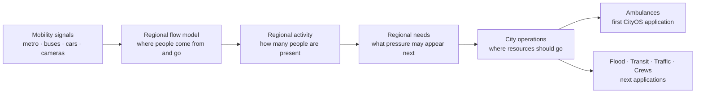

# CityOS São Paulo

> **An operational system for São Paulo: model how people move, estimate what each region needs, and coordinate city resources before pressure becomes a crisis.**

## The idea

- São Paulo is one connected system—not a collection of isolated departments.
- People move continuously between home, work, schools, stations, hospitals, events, and commercial areas.
- Those movements create changing needs for:
  - emergency response;
  - transit capacity;
  - flood operations;
  - traffic control;
  - public safety;
  - field crews and public services.
- **CityOS models that shared urban flow once and lets many municipal applications use it.**

The hackathon application is **Ambulance Allocation**. It is the first application built on CityOS—not the definition or limit of the platform.



## Why start with urban flow?

- Directly measuring every person and every need is impossible—and undesirable.
- Mobility systems already provide useful aggregate signals:
  - **Metro:** station entries, exits, transfers, schedules, and service disruptions.
  - **Buses:** routes, GPS positions, speed, headway, and passenger-volume signals.
  - **Cars:** directed road topology, speeds, camera counts, congestion, and closures.
  - **Events:** concerts, demonstrations, floods, and temporary road restrictions.
- These signals are:
  - already grouped in space and time;
  - easier to anonymize;
  - strongly related to where city activity is increasing or decreasing;
  - reusable across many public-service problems.

CityOS therefore asks:

> **How many people are moving between regions, how long will they remain there, and what municipal need does that activity create?**

## 1. Divide São Paulo into operational regions

- CityOS uses **H3 resolution 8** cells as a shared spatial language.
- Each cell can contain:
  - road nodes and directed road edges;
  - metro stations and transit access;
  - bus corridors;
  - camera observations;
  - hospitals and municipal facilities;
  - event or flood impact areas;
  - demand and resource forecasts.
- Every data source is mapped to the same cell IDs.

Let:

$$
\mathcal{H}=\{h_1,h_2,\ldots,h_n\}
$$

be the set of city regions and:

$$
\mathcal{M}=\{\text{metro},\text{bus},\text{car},\text{walk},\text{bike}\}
$$

the available mobility modes.

## 2. Model flow between regions

For each pair of regions, mode, and five-minute interval, CityOS estimates:

$$
F_{ij}^{(m)}(t)
=
\text{people moving from region }h_i\text{ to }h_j
\text{ using mode }m
$$

The combined regional flow is:

$$
F_{ij}(t)=\sum_{m\in\mathcal{M}}\omega_m F_{ij}^{(m)}(t)
$$

where $\omega_m$ converts each mode into a comparable people-flow estimate.

### What each mode tells us

- **Metro flow**
  - station entry increases activity near the origin;
  - station exit increases activity near the destination;
  - transfers explain movement across distant regions;
  - disruptions shift pressure to buses and roads.
- **Bus flow**
  - GPS and speed describe corridor movement;
  - route and headway connect origin and destination regions;
  - passenger factors convert vehicle movement into people movement.
- **Car flow**
  - camera crossings constrain specific directed edges;
  - road speed estimates congestion and travel time;
  - road direction prevents an observation from affecting the wrong traffic direction.

### Filling the gaps

Sensors do not cover every road or every time bucket. CityOS estimates the missing directional flows with:

$$
\hat f_t=
\arg\min_{f\ge 0}
\underbrace{\|W_t(H_tf-y_t)\|_2^2}_{\text{fit observed counts}}
+\lambda_s\underbrace{f^\top L_Ef}_{\text{nearby roads behave coherently}}
+\lambda_t\underbrace{\|f-f_{t-1}\|_2^2}_{\text{temporal continuity}}
+\lambda_c\underbrace{\|Bf-b_t\|_2^2}_{\text{flow conservation}}
$$

- $y_t$: observed counts.
- $H_t$: mapping from sensors to directed edges.
- $W_t$: observation confidence.
- $L_E$: relationship between neighboring road edges.
- $B$: network incidence matrix.
- $b_t$: legitimate sources and sinks at boundaries or activity centers.

The result is:

- non-negative;
- directional;
- deterministic;
- confidence-aware;
- explicit about which values are observed and which are inferred.

## 3. Convert movement into people present

Flow says who is moving. City operations also need an estimate of **who is present**.

For a road edge $e$:

$$
N_e(t)=f_e(t)\cdot\tau_e(t)\cdot\kappa_e
$$

- $f_e(t)$: vehicles or people per hour.
- $\tau_e(t)$: time spent on the edge.
- $\kappa_e$: conservative occupancy factor for car, bus, motorcycle, bicycle, or pedestrian flow.

Congested travel time uses the BPR function:

$$
\tau_e(t)=\tau_e^0
\left[1+0.15\left(\frac{f_e(t)}{c_e}\right)^4\right]
$$

- $\tau_e^0$: free-flow travel time.
- $c_e$: approximate edge capacity.
- A blocked edge receives $\tau_e(t)=\infty$.

Edge occupancy is allocated to H3 regions:

$$
\rho_h(t)=
\frac{1}{A_h}
\sum_e \omega_{he}N_e(t)
$$

- $\omega_{he}$: proportion of edge $e$ assigned to cell $h$.
- $A_h$: area of cell $h$.
- $\rho_h(t)$: inferred people/activity density.

## 4. Estimate what each region needs

Presence alone is not need. CityOS combines activity with context:

- current and forecast mobility density;
- time of day and periodic patterns;
- land use and resident-population priors;
- transit accessibility;
- hospitals and public facilities;
- active events, floods, closures, or other scenarios;
- uncertainty in the underlying observations.

For a municipal need type $k$ in region $h$:

$$
\lambda_h^{(k)}(t)=
\exp\left(
\beta_0^{(k)}
+\beta^{(k)\top}z_{h,t}
+u_h^{(k)}
+s^{(k)}(t)
+\sum_r\gamma_r^{(k)}K_r(h,t)
\right)
$$

- $z_{h,t}$: flow, density, accessibility, and contextual features.
- $u_h$: persistent regional effect.
- $s(t)$: time pattern.
- $K_r(h,t)$: effect of scenario $r$.
- $\lambda_h^{(k)}(t)$: expected need intensity—not an identified individual.

For the ambulance application:

$$
N_{h,t}^{\text{calls}}
\sim
\operatorname{Poisson}
\left(\lambda_h^{\text{ambulance}}(t)\Delta t\right)
$$

- Calls are synthetic and seeded.
- The same immutable call tape is used for every policy.
- The system forecasts regional pressure; it does not predict individual medical emergencies.

## 5. Allocate city resources

CityOS turns predicted need into an operational placement problem:

$$
\min_x
\quad
\operatorname{CVaR}_{0.90}(T(x))
+\lambda_R R(x,x_{prev})
+\lambda_E E(x)
$$

subject to:

$$
\sum_i x_i=p,
\qquad
x_i\in\mathbb{Z}_{\ge0}
$$

- $T(x)$: response-time distribution under placement $x$.
- $R(x,x_{prev})$: cost of moving resources.
- $E(x)$: penalty for poor geographic equity.
- $p$: available fleet or resource count.
- CVaR90 focuses the optimization on the worst responses—not only the average.

The same approach can allocate:

- ambulances;
- flood-response equipment;
- traffic agents;
- maintenance crews;
- temporary transit capacity;
- inspection or public-service teams.

## First application: Ambulance Allocation

### Before

- Static, demand-aware placement.
- Built from long-run average synthetic demand.
- Does not know the upcoming event or short-horizon forecast.
- Represents a credible non-predictive operational policy.

### After

- Forecasts the next 60 simulated minutes.
- Reoptimizes every 15 minutes and after scenario changes.
- Moves only available ambulances.
- Keeps repositioning ambulances dispatchable.
- Includes movement cost, minimum benefit, and equity safeguards.

### Fair comparison

- Same fleet size.
- Same call IDs, times, locations, and priorities.
- Same traffic and road closures.
- Same scene, transport, and handoff durations.
- Separate simulation state prevents policy leakage.
- Seed `42` reproduces the judged demo.

### Main result

- Primary metric: **empirical p90 response time**.
- Supporting evidence:
  - mean, p50, and p95;
  - service within 8, 12, and 20 minutes;
  - worst-district p90;
  - queued and unserved calls;
  - repositioning distance.

## What is implemented

- **Spatial engine**
  - directed São Paulo road graph;
  - one-way and parallel-edge preservation;
  - H3 resolution-8 grid;
  - stable IDs, capacity, geometry, and free-flow cost;
  - local PMTiles basemap pipeline.
- **Mobility sensing**
  - local YOLO adapter;
  - short-lived tracking;
  - directional counts for people, bicycles, motorcycles, cars, buses, and trucks;
  - five-minute aggregate output only.
- **Flow and density**
  - constrained sparse flow inference;
  - BPR travel time and blocked-edge behavior;
  - occupancy priors and H3 allocation;
  - confidence propagation and deterministic artifacts.
- **Scenario intelligence**
  - flood, event, and blocked-road observations;
  - typed structured parsing;
  - validation and deterministic offline fallbacks.
- **Simulation and optimization**
  - seeded call tapes;
  - full ambulance lifecycle and queueing;
  - directed time-aware routing;
  - static baseline and dynamic CVaR90 allocation;
  - paired six-hour simulation.
- **API and command portal**
  - FastAPI and replayable WebSocket stream;
  - São Paulo map with density, flow, cameras, calls, and ambulances;
  - scenario cards, fleet slider, playback, and Before/After metrics;
  - local-only assets and offline demo mode.
- **Release quality**
  - versioned Parquet, GeoJSON, NPZ, PMTiles, and JSON artifacts;
  - SHA-256 verification and corruption rejection;
  - unit, contract, API, WebSocket, component, and E2E tests;
  - deterministic fixture and smoke workflow.

## Data honesty

- **Real**
  - OpenStreetMap road geometry;
  - documented and authorized mobility-source provenance.
- **Observed**
  - aggregate directional counts from local samples.
- **Inferred**
  - missing flows;
  - travel conditions;
  - network occupancy;
  - H3 activity density.
- **Synthetic**
  - emergency calls;
  - service durations;
  - ambulance positions;
  - hackathon scenario cards.
- **Computed**
  - routes;
  - dispatches;
  - allocations;
  - response metrics.

## Privacy by design

- No facial recognition.
- No cross-camera re-identification.
- No MAC-address collection.
- No source frames or license plates in persisted artifacts.
- Track IDs expire in memory and are never exported.
- Camera artifacts contain only:
  - camera and directed-edge IDs;
  - five-minute bucket;
  - object class and direction;
  - aggregate count and confidence.

## Run the offline demo

### Requirements

- Python 3.12
- Node.js and npm
- `uv`
- Docker only to rebuild PMTiles

```bash
make install
make artifacts
make test
make demo
```

Run the automated release check with:

```bash
make smoke
```

## Hackathon walkthrough

1. Show São Paulo as connected H3 regions—not isolated points.
2. Turn on roads, cameras, directional flow, and activity density.
3. Run the static and optimized ambulance policies with seed `42`.
4. Activate the Allianz Parque event and show predicted regional pressure.
5. Activate the Aricanduva flood and show changed flows, ETAs, and positions.
6. Change fleet size and compare p90 and worst-district coverage.
7. Return to the platform message: the same CityOS core can coordinate other city resources.

## What CityOS is—and is not

- **CityOS is:**
  - an operational model of São Paulo;
  - a shared flow, need, simulation, and allocation platform;
  - a transparent decision-support system;
  - an offline-first, reproducible hackathon prototype.
- **CityOS is not:**
  - a medical device;
  - a clinical triage system;
  - a live SAMU replacement;
  - individual tracking;
  - a claim that inferred density is an exact population count.

## Documentation

- [Product and technical design](docs/superpowers/specs/2026-08-19-ambulance-flow-allocation-design.md)
- [Parallel implementation plan](docs/superpowers/plans/2026-08-19-city-os-parallel-integration.md)
- [Data and flow engine](docs/superpowers/plans/2026-08-19-city-os-data-flow-engine.md)
- [Simulation and API](docs/superpowers/plans/2026-08-19-city-os-simulation-api.md)
- [Command portal](docs/superpowers/plans/2026-08-19-city-os-command-portal.md)

---

> **Model the flow. Estimate the need. Coordinate the city.**
