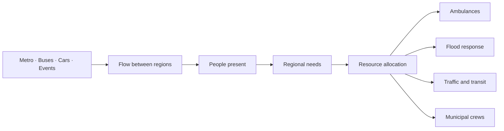

# CityOS São Paulo

> **Model the flow. Estimate the need. Coordinate the city.**

CityOS is an operational system for São Paulo.

- It models how people move between city regions.
- It estimates how many people are present in each region.
- It forecasts what each region may need next.
- It helps position limited public resources where they can create the most impact.

**Ambulance Allocation is the first CityOS application—not the whole platform.**

## One city model, many applications



## Why model flow?

People move constantly between:

- homes;
- offices;
- schools;
- metro stations;
- bus corridors;
- hospitals;
- commercial areas;
- concerts and major events.

That movement changes where public services are needed.

CityOS uses aggregate mobility signals because they are:

- easier to obtain than direct measurements of every person;
- naturally grouped by place and time;
- useful without identifying individuals;
- reusable across different municipal operations.

## How CityOS works

### 1. Divide São Paulo into regions

- The city is divided into H3 resolution-8 cells.
- Every source uses the same regional IDs.
- A cell can contain:
  - roads;
  - metro stations;
  - bus corridors;
  - cameras;
  - hospitals;
  - events;
  - flood or closure areas.

### 2. Estimate movement between regions

CityOS combines different modes:

- **Metro**
  - station entries and exits;
  - transfers;
  - schedules and disruptions.
- **Buses**
  - routes and GPS positions;
  - speed and headway;
  - passenger-volume factors.
- **Cars**
  - directed roads;
  - camera counts;
  - traffic speed and congestion;
  - road closures.

For origin region `i`, destination region `j`, and time `t`:

```math
F_{ij}(t)=F_{ij}^{metro}(t)+F_{ij}^{bus}(t)+F_{ij}^{car}(t)
```

- `F` is the estimated people flow.
- Every direction is modeled separately.
- Five-minute time buckets show how the city changes during the day.

When observations are missing, CityOS estimates them using:

- nearby road behavior;
- the previous time bucket;
- network flow conservation;
- observation confidence;
- non-negative constraints.

```math
EstimatedFlow = SensorFit + SpatialConsistency + TimeConsistency + FlowConservation
```

### 3. Estimate how many people are present

People present in a region depend on:

- residents already there;
- arrivals from other regions;
- departures to other regions;
- time spent traveling or staying there;
- vehicle occupancy and transit capacity.

```math
P_h(t)=P_h(t-1)+Arrivals_h(t)-Departures_h(t)
```

- `P_h(t)` is the estimated activity in region `h`.
- It is an operational density proxy—not an exact population count.

Road congestion also changes occupancy and travel time:

```math
TravelTime=FreeFlowTime\left[1+0.15\left(\frac{Flow}{Capacity}\right)^4\right]
```

### 4. Estimate regional needs

People present do not automatically equal public-service demand.

CityOS also considers:

- time of day;
- historical regional patterns;
- land use;
- transit accessibility;
- hospitals and facilities;
- concerts and demonstrations;
- floods and blocked roads;
- uncertainty in the input data.

```math
Need_h(t)=Base_h+Mobility_h(t)+Context_h(t)+Scenario_h(t)
```

The result is a regional need intensity for each application:

- emergency calls;
- flood assistance;
- traffic management;
- transit support;
- field crews.

### 5. Position city resources

CityOS searches for a resource placement that balances:

- fast response;
- fewer extreme delays;
- geographic equity;
- low repositioning cost;
- available fleet size.

```math
BestPlacement=Minimum\left(TailResponse+MovementCost+EquityPenalty\right)
```

The ambulance application focuses on p90: the response time experienced by the slowest 10% of calls.

## First application: Ambulance Allocation

### Before

- Static ambulance positions.
- Based on long-term average demand.
- No knowledge of the next event or disruption.

### After

- Forecasts the next 60 minutes.
- Repositions available ambulances.
- Reoptimizes every 15 minutes.
- Reacts immediately to scenario changes.
- Includes movement and geographic-equity costs.

### Fair experiment

Both policies receive the same:

- fleet size;
- emergency calls;
- call priorities;
- traffic conditions;
- road closures;
- service durations;
- random seed.

The primary comparison is:

- **Before p90 response time**;
- **After p90 response time**;
- improvement in minutes and percentage.

Supporting metrics include:

- mean, p50, and p95;
- service within 8, 12, and 20 minutes;
- worst-district p90;
- queued and unserved calls;
- repositioning distance.

## What is implemented

- **City data layer**
  - directed São Paulo road graph;
  - H3 regional grid;
  - versioned and checksummed artifacts;
  - local PMTiles basemap.
- **Mobility layer**
  - privacy-safe camera processing;
  - directional people, bicycle, motorcycle, car, bus, and truck counts;
  - five-minute aggregate buckets;
  - graph-wide flow inference;
  - H3 activity density.
- **Scenario layer**
  - event, flood, and blocked-road cards;
  - typed validation;
  - deterministic offline fallback.
- **Simulation layer**
  - seeded emergency-call generation;
  - ambulance dispatch and full lifecycle;
  - directed routing and closures;
  - static and optimized policies;
  - paired six-hour simulation.
- **Optimization layer**
  - tail-response objective;
  - equity penalty;
  - repositioning cost;
  - deterministic local search.
- **Product layer**
  - FastAPI service;
  - WebSocket simulation stream;
  - offline São Paulo command portal;
  - fleet controls, scenarios, playback, map layers, and Before/After metrics.
- **Release layer**
  - one-command demo;
  - offline assets;
  - deterministic seed `42`;
  - unit, contract, API, WebSocket, component, and end-to-end tests.

## Data honesty

- **Real:** OpenStreetMap roads and documented mobility-source provenance.
- **Observed:** aggregate directional counts.
- **Inferred:** missing flow, congestion, occupancy, and regional density.
- **Synthetic:** emergency calls, ambulance positions, and hackathon scenarios.
- **Computed:** routes, allocations, response times, and metrics.

## Privacy

- No facial recognition.
- No cross-camera identification.
- No MAC-address collection.
- No source frames in persisted artifacts.
- Temporary track IDs expire in memory.
- Only aggregate counts and confidence are stored.

## Run the demo

```bash
make install
make artifacts
make test
make demo
```

`make demo` validates bundled assets and starts the local API and command portal. Open the portal address printed in the terminal.

On Windows, run the Make targets from Git Bash or WSL. The portable Python launchers can also be
run from PowerShell, for example `uv run --project backend python scripts/demo_start.py`.

For the automated release check:

```bash
make smoke
```

## Hackathon walkthrough

1. Show São Paulo divided into connected regions.
2. Show mobility flow and activity density.
3. Run the Before and After ambulance policies.
4. Activate the Allianz Parque event.
5. Activate the Aricanduva flood.
6. Change the fleet size.
7. Compare p90 and worst-district coverage.
8. Show how the same CityOS core can support other city operations.

## Important boundaries

- CityOS is a decision-support prototype.
- It does not identify or predict individual people.
- It is not a medical device.
- It is not a live SAMU dispatch replacement.
- Inferred density is not an exact census measurement.

## Documentation

- [Demo and release runbook](docs/demo-runbook.md)
- [Privacy and data handling](docs/privacy-and-data.md)
- [Product and technical design](docs/superpowers/specs/2026-08-19-ambulance-flow-allocation-design.md)
- [Parallel implementation and integration plan](docs/superpowers/plans/2026-08-19-city-os-parallel-integration.md)
- [Data and flow engine](docs/superpowers/plans/2026-08-19-city-os-data-flow-engine.md)
- [Simulation and API](docs/superpowers/plans/2026-08-19-city-os-simulation-api.md)
- [Command portal](docs/superpowers/plans/2026-08-19-city-os-command-portal.md)

---

> **CityOS turns movement into operational intelligence for São Paulo.**
