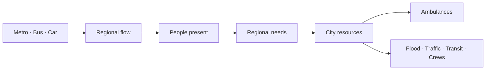

# CityOS São Paulo

> **Model the flow. Estimate the need. Coordinate the city.**

CityOS is an operational system for São Paulo.

- It models how people move between regions.
- It estimates what each region may need next.
- It helps position limited city resources.
- Ambulance Allocation is its first application—not the whole platform.



## How CityOS works

### 1. Divide the city into regions

- São Paulo is divided into H3 cells.
- Every source uses the same regional IDs.
- Each region connects:
  - roads;
  - metro stations;
  - bus corridors;
  - cameras;
  - hospitals;
  - events and disruptions.

### 2. Model movement

CityOS combines aggregate mobility signals:

- **Metro:** entries, exits, transfers, and disruptions.
- **Bus:** routes, GPS, speed, headway, and passenger factors.
- **Car:** directed roads, camera counts, speed, congestion, and closures.

```math
F_{ij}(t)=F_{ij}^{metro}(t)+F_{ij}^{bus}(t)+F_{ij}^{car}(t)
```

- `i`: origin region.
- `j`: destination region.
- `t`: five-minute interval.
- `F`: estimated people flow.

Missing observations are inferred from:

- nearby roads;
- previous time buckets;
- sensor confidence;
- network flow conservation.

### 3. Estimate people and needs

```math
People_h(t)=People_h(t-1)+Arrivals_h(t)-Departures_h(t)
```

CityOS combines regional activity with:

- time of day;
- land use;
- transit access;
- hospitals and facilities;
- events, floods, and closures.

```math
Need_h(t)=Base_h+Flow_h(t)+Context_h(t)+Events_h(t)
```

This produces an operational need estimate—not an exact population count or an individual prediction.

### 4. Position resources

```math
x^*=\min_x\left[P90(x)+Movement(x)+Equity(x)\right]
```

CityOS balances:

- response time;
- extreme delays;
- geographic equity;
- repositioning cost;
- available resources.

The same model can position:

- ambulances;
- flood equipment;
- traffic agents;
- transit support;
- municipal field crews.

## First application: Ambulance Allocation

CityOS compares two policies under identical conditions.

### Before

- Static ambulance positions.
- Based on long-term average demand.
- No knowledge of upcoming events.

### After

- Forecasts the next 60 minutes.
- Repositions available ambulances.
- Reoptimizes every 15 minutes.
- Reacts to floods, events, and blocked roads.

### Fair comparison

Both policies use the same:

- fleet size;
- emergency calls;
- traffic;
- closures;
- service durations;
- random seed.

The main result is the **p90 response time**: the response experienced by the slowest 10% of calls.

## What is implemented

- Directed São Paulo road graph and H3 grid.
- Metro, bus, car, camera, event, and disruption signals in the regional model.
- Privacy-safe directional camera counts.
- Citywide flow and activity-density inference.
- Flood, event, and blocked-road scenarios.
- Synthetic and deterministic emergency calls.
- Complete ambulance dispatch lifecycle.
- Static and optimized allocation policies.
- Paired six-hour simulation.
- FastAPI and WebSocket streaming.
- Offline São Paulo command portal.
- Fleet controls, playback, map layers, and Before/After metrics.
- Versioned and checksummed local artifacts.
- Unit, API, WebSocket, component, and end-to-end tests.

## Data honesty

- **Real:** OpenStreetMap roads and documented mobility sources.
- **Observed:** aggregate directional counts.
- **Inferred:** missing flows, congestion, occupancy, and density.
- **Synthetic:** emergency calls, ambulances, and hackathon scenarios.
- **Computed:** routes, allocations, response times, and metrics.

## Privacy

- No facial recognition.
- No cross-camera identification.
- No MAC-address collection.
- No source frames in persisted artifacts.
- Temporary tracking IDs are never exported.
- Only aggregate counts and confidence are stored.

## Run the demo

```bash
make install
make artifacts
make test
make demo
```

Automated verification:

```bash
make smoke
```

## Demo story

1. Show how people move between São Paulo regions.
2. Show the resulting activity and need estimates.
3. Run static and optimized ambulance policies.
4. Activate a concert or flood scenario.
5. Compare p90 and worst-district coverage.
6. Show how CityOS can support other city operations.

## Boundaries

- Decision-support prototype—not a medical device.
- Not a live SAMU replacement.
- Does not identify or predict individuals.
- Inferred density is not an exact census measurement.

## Documentation

- [Product design](docs/superpowers/specs/2026-08-19-ambulance-flow-allocation-design.md)
- [Integration plan](docs/superpowers/plans/2026-08-19-city-os-parallel-integration.md)
- [Data and flow engine](docs/superpowers/plans/2026-08-19-city-os-data-flow-engine.md)
- [Simulation and API](docs/superpowers/plans/2026-08-19-city-os-simulation-api.md)
- [Command portal](docs/superpowers/plans/2026-08-19-city-os-command-portal.md)

---

> **CityOS turns urban movement into operational intelligence.**
