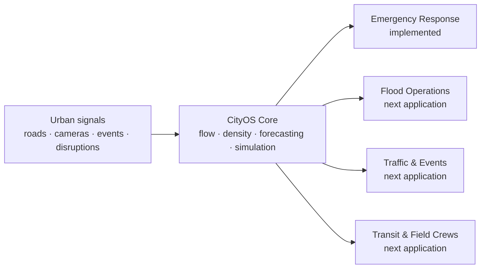

# CityOS São Paulo

> A city-scale operational system that turns urban signals into coordinated, testable decisions.

CityOS gives São Paulo a shared intelligence layer for understanding what is happening across the city, anticipating what may happen next, and testing operational responses before acting in the real world.

For this hackathon, we built the first CityOS application: **Ambulance Allocation**. It demonstrates how the platform can combine street topology, mobility observations, inferred population activity, disruptions, and simulation to evaluate where ambulances should be positioned to reduce emergency response times—especially the slowest, most critical responses.

The ambulance use case is not CityOS itself. It is the first application running on top of a reusable urban operations platform.

## One city, one operational layer, many applications

São Paulo already produces signals through roads, cameras, transport systems, public events, weather, and municipal services. These sources are usually separated by agency and use case. CityOS connects them through a common spatial and temporal model.



The same core that estimates road flow and activity for ambulance positioning can support flood response, traffic management, major-event planning, transit operations, road maintenance, and the allocation of municipal field teams.

## The hackathon case: Ambulance Allocation

The challenge is simple to state and difficult to solve: **where should a limited fleet be positioned so that more people receive timely emergency assistance—even when traffic, demand, and road availability change?**

CityOS runs a fair, paired experiment:

- **Before:** a competent static positioning policy based on long-run average demand.
- **After:** a dynamic, event-aware policy that anticipates demand and repositions available ambulances.
- Both policies receive the same fleet size, seeded emergency calls, service durations, traffic conditions, and disruptions.
- The primary outcome is the empirical **90th-percentile response time (p90)**, not an easier-to-improve average.

The result is a reproducible counterfactual: not “what happened,” but “what could improve if the city coordinated resources differently under the same conditions?”

## What is implemented

CityOS is an end-to-end, offline-first working prototype—not a collection of mock screens.

| Capability | Implemented behavior |
|---|---|
| City spatial model | Directed São Paulo road graph with one-way and parallel-road preservation, stable identifiers, road capacity, free-flow time, and H3 resolution-8 cells |
| Versioned artifacts | Deterministic Parquet, GeoJSON, NPZ, and PMTiles pipelines with schema versions, row counts, provenance, bounds, and SHA-256 checksums |
| Privacy-safe vision | Local YOLO adapter and short-lived tracking count pedestrians, bicycles, motorcycles, cars, buses, and trucks by direction in five-minute buckets |
| Network flow | Sparse observations are expanded into non-negative citywide directional flow estimates with temporal, spatial, and conservation constraints |
| Travel conditions | BPR congestion costs, observed confidence, scenario penalties, and explicit blocked-road behavior |
| Activity density | Edge occupancy is converted into an H3 activity-density proxy with occupancy priors, uncertainty, and emergency intensity |
| Scenario sensor | Typed flood, event, and blocked-road observations with structured parsing, validation, and deterministic offline fallbacks |
| Demand model | Reproducible synthetic emergency call tapes generated from density, time, and active scenario effects |
| Ambulance simulation | Complete ambulance lifecycle, priority queueing, directed routing, dispatch, scene, transport, handoff, release, and repositioning |
| Paired policies | Isolated baseline and optimized worlds consume the exact same immutable event tape |
| Dynamic allocation | Seeded greedy initialization and local search optimize a CVaR90 tail-response objective with equity and repositioning costs |
| Metrics | Mean, p50, p90, p95, service within 8/12/20 minutes, worst-district p90, queue, unserved calls, and repositioning distance |
| Local API | FastAPI bootstrap, scenario parsing, simulation creation/status, health checks, and replayable WebSocket streaming |
| Command portal | Offline São Paulo map, H3 density, directional flow, cameras, ambulances, calls, scenario impacts, fleet controls, playback, and Before/After comparison |
| Offline release | Bundled assets, pinned dependencies, deterministic seed `42`, one-command startup, smoke tests, and zero required external requests during the demo |

## From signal to decision

Every visible recommendation can be followed through the system:

1. **Observe:** privacy-safe directional counts describe movement without retaining identities.
2. **Infer:** graph-constrained estimation fills gaps and exposes confidence instead of pretending every road is directly measured.
3. **Understand:** network occupancy becomes an H3 activity-density layer.
4. **Anticipate:** density, time, and scenarios generate a transparent emergency-demand forecast.
5. **Test:** identical seeded calls are replayed under static and dynamic allocation policies.
6. **Decide:** the portal explains the p90 improvement, service coverage, geographic equity, and movement cost.

## Run the demo

### Requirements

- Python 3.12
- Node.js and npm
- `uv`
- Docker only when rebuilding the local PMTiles basemap

### One-command workflow

```bash
make install
make artifacts
make test
make demo
```

`make demo` validates bundled assets and starts the local API and command portal. Open the portal address printed in the terminal.

For the automated release check:

```bash
make smoke
```

The smoke test starts both services, waits for their health checks, runs seed `42`, verifies at least 72 five-minute frames for each policy, and terminates the child processes cleanly.

### Optional SPTrans Olho Vivo check

The minimal server-side SPTrans client reads its application key only from the environment,
performs the required Olho Vivo handshake internally, and fetches citywide vehicle positions.
Never commit the key or place it in command-line arguments.

```bash
export SPTRANS_API_KEY="<your Olho Vivo application key>"
uv run --directory backend python ../scripts/check_sptrans.py
```

SPTrans is optional and is not contacted during the offline judged demo or automated tests.

## Five-minute hackathon walkthrough

1. Open the São Paulo operations map and inspect roads, camera observations, inferred flow, and H3 activity density.
2. Run the normal scenario and compare the static **Before** policy with the optimized **After** policy.
3. Activate the concert scenario near Allianz Parque and watch future demand shift before calls occur.
4. Activate the Aricanduva flood scenario and see blocked roads change ETAs and positioning recommendations.
5. Change the fleet size and rerun the same seed to show how capacity affects p90 and worst-district coverage.
6. Finish on the p90 comparison: the same city conditions and calls, with a better operational allocation.

## Data honesty: real, inferred, and simulated

CityOS labels every layer so decision-makers know what they are seeing.

| Label | Meaning in the demo |
|---|---|
| **Real** | OpenStreetMap road geometry and documented, authorized mobility-source provenance |
| **Observed** | Aggregate directional counts produced from local camera samples |
| **Inferred** | Graph-wide traffic flow, travel conditions, network occupancy, and H3 activity density |
| **Synthetic** | Emergency calls, service durations, ambulance positions, and hackathon scenario cards |
| **Computed** | Routes, dispatches, allocations, response times, and comparison metrics |

The synthetic baseline is calibrated to the municipality's published 2024 mean response-time reference of 21 minutes for extreme-severity ECHO occurrences. The project does **not** claim that São Paulo publishes a p90 baseline or that the simulated positions reproduce actual SAMU operations.

## Privacy by design

- No facial recognition.
- No cross-camera re-identification.
- No MAC-address collection.
- Track identifiers exist only briefly in memory to prevent double counting.
- Persisted camera outputs contain aggregate class, direction, count, confidence, edge, and time bucket only.
- The authorized real-sample annotation retains provenance and aggregate counts, not source frames, faces, license plates, or credentials.

## Architecture

```text
backend/
  src/city_os/
    spatial/       directed roads, H3 grid, artifact generation
    vision/        local detection, transient tracking, line counting
    flow/          network inference, travel time, H3 density
    contracts/     shared API and artifact schemas
    integrations/  optional authenticated external-source clients
    scenarios/     typed scenario observations and fallbacks
    demand/        deterministic emergency call tapes
    routing/       time-aware directed travel times
    simulation/    ambulance lifecycle and paired engine
    optimization/  static baseline and dynamic CVaR90 allocation
    api/           FastAPI routes, jobs, artifact loading, WebSockets
frontend/          CityOS command portal
data/              versioned local artifacts and acceptance fixtures
scripts/           explicit build, processing, demo, and smoke workflows
```

The runtime API exposes:

- `GET /api/bootstrap`
- `POST /api/simulations`
- `GET /api/simulations/{id}`
- `WS /api/simulations/{id}/stream`
- `POST /api/scenario-cards/parse`
- `GET /healthz`

## Reproducibility and verification

- Six simulated hours in five-minute buckets.
- Reoptimization every 15 simulated minutes and after scenario changes.
- A 60-minute forecast horizon.
- H3 resolution 8.
- Deterministic ordering and seeded randomness.
- Byte-identical paired call tapes.
- Checksummed artifact manifests and corruption rejection.
- Unit, contract, API, WebSocket, component, and end-to-end tests.
- Playwright verification that the offline demo emits no non-localhost requests.

## What CityOS is—and is not

CityOS is a decision-support and operations-research platform for exploring city-scale coordination. It is not a medical device, a clinical triage system, a live SAMU dispatch replacement, or a claim about individual patients.

The hackathon prototype demonstrates the operational loop with ambulances because emergency response makes the value measurable and human. The larger proposition is broader:

> **Give São Paulo one operational model of the city, then let every municipal application reason from the same streets, signals, scenarios, and evidence.**

## Documentation

- [Product and technical design](docs/superpowers/specs/2026-08-19-ambulance-flow-allocation-design.md)
- [Parallel implementation and integration plan](docs/superpowers/plans/2026-08-19-city-os-parallel-integration.md)
- [Data and flow engine](docs/superpowers/plans/2026-08-19-city-os-data-flow-engine.md)
- [Simulation and API](docs/superpowers/plans/2026-08-19-city-os-simulation-api.md)
- [Command portal](docs/superpowers/plans/2026-08-19-city-os-command-portal.md)

---

Built for the hackathon in São Paulo, for São Paulo—with a platform designed to grow beyond a single use case.
