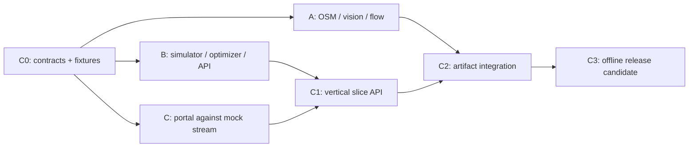

# City OS Parallel Integration Implementation Plan

> **For agentic workers:** REQUIRED SUB-SKILL: Use superpowers:subagent-driven-development (recommended) or superpowers:executing-plans to implement this plan task-by-task. Steps use checkbox (`- [ ]`) syntax for tracking.

**Goal:** Deliver an offline-first City OS hackathon demo using three developers and three machines without shared-file contention.

**Architecture:** Developer A produces versioned São Paulo road, camera-flow, and H3-density artifacts. Developer B owns shared contracts, the paired baseline/optimized simulator, optimizer, and FastAPI service. Developer C owns the browser portal and consumes only the frozen API/schema and fixtures. Integration proceeds through contract, vertical-slice, artifact, and release checkpoints.

**Tech Stack:** Python 3.12, FastAPI, Pydantic 2, NetworkX/OSMnx, GeoPandas/Shapely/H3, NumPy/SciPy, OpenCV/Ultralytics; Next.js, React, TypeScript, MapLibre GL, deck.gl, Vitest, Playwright; Parquet, GeoJSON, NPZ, PMTiles.

**Spec:** `docs/superpowers/specs/2026-08-19-ambulance-flow-allocation-design.md`

## Global Constraints

- The demo must run without internet after dependencies and bundled artifacts are installed.
- São Paulo municipality, H3 resolution 8, five-minute data buckets, six simulated hours, 15-minute optimization cadence, and a 60-minute forecast horizon are fixed.
- Primary result is paired baseline-versus-optimized 90th-percentile response time using the same seeded call tape.
- Do not identify people, persist faces, or collect MAC addresses. Camera processing emits aggregate directional counts only.
- No placeholders, TODOs, fake buttons, silent fallbacks, or hand-copied duplicate schemas.

---

## Workstream Ownership

| Lane | Branch | Exclusive ownership | Must not edit |
|---|---|---|---|
| Developer A — Data/Flow | `dev-a/data-flow` | `backend/src/city_os/{spatial,vision,flow}/`, matching tests, data-related `scripts/{fetch,build,process}_*`, `data/fixtures/{flow,vision}/`, generated map/flow artifacts | contracts, API, frontend, root demo scripts |
| Developer B — Simulation/API | `dev-b/simulation-api` | `backend/pyproject.toml`, `backend/schema/`, `backend/src/city_os/{contracts,scenarios,demand,routing,simulation,optimization,api}/`, matching tests | A packages, frontend |
| Developer C — Portal | `dev-c/portal` | `frontend/` | backend, data artifact builders |
| Integrator | `integration` | `Makefile`, root `README.md`, `scripts/demo_*`, merge conflict resolution | feature behavior without owner review |

Contract changes require a small commit on Developer B's branch, acknowledgements from A and C, and regeneration of fixtures/types. Developers never resolve a cross-lane mismatch by editing another lane directly.

## Frozen Contract Surface

Developer B publishes Pydantic models and JSON Schema for:

- `ScenarioObservation(id, type, starts_at, ends_at, affected_h3, demand_multiplier, travel_penalty, blocked_edges, confidence, source)`
- `SimulationRequest(scenario_id, fleet_size, seed)`
- `AmbulanceSnapshot(id, status, node_id, target_node_id, call_id)`
- `CallSnapshot(id, h3_cell, node_id, priority, status, occurred_at_minute, response_seconds)`
- `SimulationMetrics(policy, mean_seconds, p50_seconds, p90_seconds, p95_seconds, within_8m_pct, within_12m_pct, within_20m_pct, worst_district_p90_seconds, queued_calls, unserved_calls, reposition_km)`
- `SimulationFrame(minute, policy, ambulances, calls, metrics, active_scenario_ids)`

Developer A's artifact schemas are frozen alongside them:

- `RoadNode(node_id, x, y, h3_cell)`
- `RoadEdge(edge_id, u, v, length_m, free_flow_seconds, capacity_vph, geometry_wkb)`
- `CameraObservation(camera_id, edge_id, bucket_start, object_class, direction, count, confidence)`
- `EdgeState(edge_id, bucket_start, flow_vph, speed_kph, travel_seconds, occupancy_people, confidence)`
- `H3Density(cell, bucket_start, density_people_km2, emergency_intensity_hour, confidence)`

## Checkpoints

- **C0, first 60–90 minutes:** backend scaffold, schemas, sample bootstrap response, and sample stream frames land on `integration`.
- **C1, mid-build:** B serves a deterministic toy simulation; C renders it end to end; A publishes a small valid spatial fixture.
- **C2, feature complete:** A's artifact manifest loads in B; C uses the real local API; all lane tests pass.
- **C3, release:** offline startup, seeded demo, p90 comparison, scenario injection, performance, and privacy checks pass on a clean machine.

## Parallel Execution Board

| Timebox | Developer A | Developer B | Developer C | Exit condition |
|---|---|---|---|---|
| T+0–90 min | Prepare toy directed graph and inspect contract proposal | Backend scaffold, schemas, fixtures | Portal scaffold and visual shell | C0 contract SHA frozen |
| T+1.5–4 h | OSM/H3 artifacts | scenario tape, routing/lifecycle | generated types, mock transport, map layers | C1 toy vertical slice |
| T+4–8 h | camera counter, flow/BPR | baseline, CVaR optimizer, paired engine | scenarios, playback, metrics | lane unit suites green |
| T+8–10 h | density artifacts and manifest | API/WebSocket and artifact loading | switch to local API and E2E | C2 integrated feature set |
| Final 2 h | data/privacy validation | determinism/performance tuning | offline/visual polish | C3 demo rehearsed on all machines |

The critical path is C0 → paired simulator → local API → portal E2E. If time slips, preserve real OSM, paired seeded calls, scenario shocks, and p90 comparison; reduce camera source quantity or map ornamentation before weakening the optimizer or fairness of the comparison.

## Task 1: Establish Integration Branch and Contract Gate

**Files:**
- Create: `docs/superpowers/plans/2026-08-19-city-os-parallel-integration.md`
- Verify: `backend/src/city_os/contracts/`
- Verify: `backend/tests/contracts/`
- Verify: `backend/schema/city-os.schema.json`
- Verify: `backend/tests/fixtures/contracts/`

- [ ] Create `integration` from the approved-spec commit and create the three feature branches from exactly that SHA.
- [ ] Developer B completes Task 1 of the simulation/API plan and opens the C0 change.
- [ ] Run `cd backend && uv run pytest tests/contracts -q`; confirm schema and fixture tests pass.
- [ ] C checks out the C0 commit, runs `cd frontend && npm run contracts:generate && npm run contracts:check`, and confirms generated TypeScript is current.
- [ ] Have A confirm artifact field names and C confirm renderable frame fields before merging C0.
- [ ] Merge C0 into `integration`; each developer rebases once, then resumes only within owned paths.
- [ ] Commit: `chore: freeze City OS MVP contracts`

## Task 2: Integrate the First Vertical Slice

**Files:**
- Verify: `data/fixtures/flow/manifest.json`
- Verify: `backend/tests/api/test_vertical_slice.py`
- Verify: `frontend/tests/e2e/vertical-slice.spec.ts`

- [ ] A publishes a two-district fixture containing a directed graph, H3 cells, edge state, and density rows.
- [ ] B publishes `GET /api/bootstrap`, `POST /api/simulations`, polling, and WebSocket streaming over a deterministic toy world.
- [ ] C replaces its in-memory transport with the local API adapter while retaining mock transport for component tests.
- [ ] Run `uv run pytest tests/api/test_vertical_slice.py -q`; assert seed `42` creates identical baseline and optimized call IDs.
- [ ] Run `npm run test:e2e -- vertical-slice.spec.ts`; assert the map advances, ambulances move, and both p90 cards update.
- [ ] Merge B, C, then A into `integration`, resolving only imports and manifests; send behavioral conflicts to the owning developer.
- [ ] Commit: `feat: integrate City OS vertical slice`

## Task 3: Integrate Data Artifacts with the Simulator

**Files:**
- Create: `backend/src/city_os/api/artifact_loader.py`
- Create: `backend/tests/api/test_artifact_loader.py`
- Verify: `data/artifacts/manifest.json`

- [ ] Write a failing test that loads the manifest, validates schema version and SHA-256 checksums, and rejects a mutated artifact.
- [ ] Run `cd backend && uv run pytest tests/api/test_artifact_loader.py -q`; confirm failure because the loader is absent.
- [ ] Implement `load_world(manifest_path: Path) -> SimulationWorld` with explicit errors for missing, mismatched, and unsupported artifacts.
- [ ] Run the test again and confirm pass.
- [ ] Run one paired six-hour simulation twice with seed `42`; compare serialized call tape and terminal metrics byte-for-byte.
- [ ] Verify `optimized.p90_seconds <= baseline.p90_seconds` in the bundled demo fixture; if not, fix data/optimizer assumptions rather than UI labels.
- [ ] Commit: `feat: load versioned flow artifacts into simulation`

## Task 4: Create One-Command Offline Demo

**Files:**
- Create: `Makefile`
- Create: `scripts/demo_prepare.sh`
- Create: `scripts/demo_smoke.sh`
- Modify: `README.md`
- Test: `backend/tests/api/test_offline_boot.py`

- [ ] Add commands `make install`, `make artifacts`, `make test`, `make demo`, and `make smoke`; pin dependency lockfiles.
- [ ] Make `demo_prepare.sh` validate bundled assets and fail with an actionable message rather than download at runtime.
- [ ] Make `demo_smoke.sh` start both services, wait on health endpoints, run seed `42`, verify at least 72 streamed five-minute frames per policy, and terminate child processes.
- [ ] Disconnect network access and run `make demo`; verify the basemap, scenario cards, flow, density, and simulation use local assets only.
- [ ] Run `make smoke`; record the command and outcome in `README.md`.
- [ ] Commit: `build: add offline City OS demo workflow`

## Task 5: Release Verification

**Files:**
- Create: `docs/demo-runbook.md`
- Create: `docs/privacy-and-data.md`
- Modify: `README.md`

- [ ] Run `make test` from a clean checkout and save the exact pass summary in the runbook.
- [ ] Run the demo on each of the three machines using seed `42`; confirm identical call tape and metrics within floating-point tolerance `1e-6`.
- [ ] Verify the six-hour scenario completes in at most 60 seconds on the slowest machine and map animation remains responsive.
- [ ] Verify flood, event, and road-block cards each change demand or travel cost and trigger reoptimization.
- [ ] Verify the fleet slider changes the request and both policies use the same fleet size.
- [ ] Search `rg -n "TODO|FIXME|placeholder|lorem|example\.com" backend frontend scripts README.md`; resolve every hit.
- [ ] Confirm no images, faces, MAC addresses, track identities, or camera credentials exist in artifacts.
- [ ] Rehearse the five-minute narrative: Before baseline → sensor observation → flow/density → allocation → After p90 improvement.
- [ ] Commit: `docs: add City OS demo and privacy runbooks`
